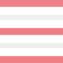

<!--
*** Thanks for checking out the Good-README-Template. If you have a suggestion that would make this better,
*** please fork the repo and create a pull request or simply open an issue with the tag "enhancement".
*** Thanks again! Now go create something AMAZING! :D
-->


<!-- PROJECT SHIELDS -->
<!--
*** I'm using markdown "reference style" links for readability.
*** Reference links are enclosed in brackets [ ] instead of parentheses ( ).
*** See the bottom of this document for the declaration of the reference variables
*** for contributors-url, forks-url, etc. This is an optional, concise syntax you may use.
*** https://www.markdownguide.org/basic-syntax/#reference-style-links
-->
[![Contributors][contributors-shield]][contributors-url]
[![Forks][forks-shield]][forks-url]
[![Stargazers][stars-shield]][stars-url]
[![Issues][issues-shield]][issues-url]
[![MIT License][license-shield]][license-url]

<!-- PROJECT LOGO -->
<br />
<p align="center">
  <a href="https://github.com/sleepred/Good-README-Template">
    
  </a>

  <h3 align="center">Good-README-Template</h3>

  <p align="center">
    An awesome README template to jumpstart your projects!
    <br />
    <a href="https://github.com/sleepred/Good-README-Template"><strong>Explore the docs »</strong></a>
    <br />
    <br />
    <a href="https://github.com/sleepred/Good-README-Template">View Demo</a>
    ·
    <a href="https://github.com/sleepred/Good-README-Template/issues">Report Bug</a>
    ·
    <a href="https://github.com/sleepred/Good-README-Template/issues">Request Feature</a>
  </p>
</p>

[](README.md) [](README_kr.md) [](README_jp.md)

<!-- TABLE OF CONTENTS -->
<details open="open">
  <summary>Table of Contents</summary>
  <ol>
    <li>
      <a href="#project-title">Project Title</a>
      <ul>
        <li><a href="#description">Description</a></li>
        <li><a href="#built-with">Built With</a></li>
      </ul>
    </li>
    <li>
      <a href="#getting-started">Getting Started</a>
      <ul>
        <li><a href="#prerequisites">Prerequisites</a></li>
        <li><a href="#installation">Installation</a></li>
      </ul>
    </li>
    <li><a href="#usage">Usage</a></li>
    <li><a href="#help">Help</a></li>
    <li><a href="#version-history">Version History</a></li>
    <li><a href="#contributing">Contributing</a></li>
    <li><a href="#license">License</a></li>
    <li><a href="#contact">Contact</a></li>
    <li><a href="#acknowledgements">Acknowledgements</a></li>
  </ol>
</details>

<!-- ABOUT THE PROJECT -->
# Project Title

Simple overview of use/purpose.

## Description

An in-depth paragraph about your project and overview of use.

<!-- GETTING STARTED -->
## Getting Started

### Prerequisites

* Describe any prerequisites, libraries, OS version, etc., needed before installing program.
* ex. Windows 10

### Installation

* How/where to download your program
* Any modifications needed to be made to files/folders

<!-- USAGE EXAMPLES -->
### Usage

* How to run the program
* Step-by-step bullets
```
code blocks for commands
```

## Help

Any advise for common problems or issues.
```
command to run if program contains helper info
```

## Version History

* 0.2
    * Various bug fixes and optimizations
    * See [commit change]() or See [release history]()
* 0.1
    * Initial Release


<!-- CONTRIBUTING -->
## Contributing

Contributions are what make the open source community such an amazing place to be learn, inspire, and create. Any contributions you make are **greatly appreciated**.

1. Fork the Project
2. Create your Feature Branch (`git checkout -b feature/AmazingFeature`)
3. Commit your Changes (`git commit -m 'Add some AmazingFeature'`)
4. Push to the Branch (`git push origin feature/AmazingFeature`)
5. Open a Pull Request


<!-- LICENSE -->
## License

This project is licensed under the [NAME HERE] License - see the LICENSE.md file for details


## Contact

Contributors names and contact info

ex. Your Name - [@your_twitter](https://twitter.com/your_username) - email@example.com

ex. Project Link: [https://github.com/your_username/repo_name](https://github.com/your_username/repo_name)


<!-- ACKNOWLEDGEMENTS -->
## Acknowledgments
* [awesome-readme](https://github.com/matiassingers/awesome-readme)
* [PurpleBooth](https://gist.github.com/PurpleBooth/109311bb0361f32d87a2)
* [dbader](https://github.com/dbader/readme-template)
* [zenorocha](https://gist.github.com/zenorocha/4526327)
* [fvcproductions](https://gist.github.com/fvcproductions/1bfc2d4aecb01a834b46)
* [GitHub Emoji Cheat Sheet](https://www.webpagefx.com/tools/emoji-cheat-sheet)
* [Img Shields](https://shields.io)
* [Choose an Open Source License](https://choosealicense.com)
* [GitHub Pages](https://pages.github.com)
* [Animate.css](https://daneden.github.io/animate.css)
* [Loaders.css](https://connoratherton.com/loaders)
* [Slick Carousel](https://kenwheeler.github.io/slick)
* [Smooth Scroll](https://github.com/cferdinandi/smooth-scroll)
* [Sticky Kit](http://leafo.net/sticky-kit)
* [JVectorMap](http://jvectormap.com)
* [Font Awesome](https://fontawesome.com)


<!-- MARKDOWN LINKS & IMAGES -->
<!-- https://www.markdownguide.org/basic-syntax/#reference-style-links -->
[contributors-shield]: https://img.shields.io/github/contributors/sleepred/Good-README-Template.svg?style=for-the-badge
[contributors-url]: https://github.com/sleepred/Good-README-Template/graphs/contributors
[forks-shield]: https://img.shields.io/github/forks/sleepred/Good-README-Template.svg?style=for-the-badge
[forks-url]: https://github.com/sleepred/Good-README-Template/network/members
[stars-shield]: https://img.shields.io/github/stars/sleepred/Good-README-Template.svg?style=for-the-badge
[stars-url]: https://github.com/sleepred/Good-README-Template/stargazers
[issues-shield]: https://img.shields.io/github/issues/sleepred/Good-README-Template.svg?style=for-the-badge
[issues-url]: https://github.com/sleepred/Good-README-Template/issues
[license-shield]: https://img.shields.io/github/license/sleepred/Good-README-Template.svg?style=for-the-badge
[license-url]: https://github.com/sleepred/Good-README-Template/blob/master/LICENSE.txt
[product-screenshot]: images/screenshot.png


